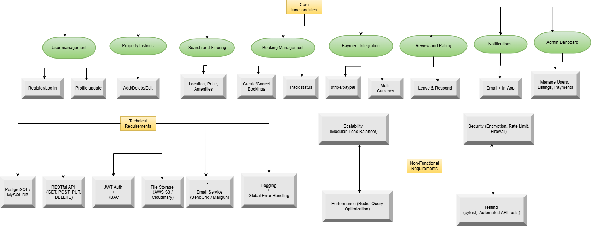

# Features and Functionalities - Airbnb Clone Backend

This document outlines the key features, technical requirements, and non-functional expectations of the backend for the Airbnb Clone project. It mirrors the structure of the attached diagram (`features-and-functionalities.png`).

---

## Core Functionalities

### User Management
- **Register / Log in**
- **Profile update**

### Property Listings
- **Add / Delete / Edit listings**

### Search and Filtering
- **Filter by location, price, and amenities**

### Booking Management
- **Create / Cancel bookings**
- **Track booking status**

### Payment Integration
- **Stripe / PayPal integration**
- **Multi-currency support**

### Review and Rating
- **Guests leave reviews**
- **Hosts respond to reviews**

### Notifications
- **Email notifications**
- **In-app notifications**

### Admin Dashboard
- **Manage users**
- **Manage listings**
- **Manage payments**

---

## Technical Requirements

- **PostgreSQL / MySQL DB**
- **RESTful API**
  - GET, POST, PUT, DELETE methods
- **JWT Authentication + RBAC**
- **File Storage**
  - (AWS S3 / Cloudinary)
- **Email Service**
  - (SendGrid / Mailgun)
- **Logging + Global Error Handling**

---

## Non-Functional Requirements

### Scalability
- Modular architecture
- Load balancer support

### Security
- Encryption for sensitive data
- Rate limiting
- Firewalls

### Performance Optimization
- Redis caching
- Query optimization

### Testing
- Unit testing with pytest
- Automated API testing

---

## Diagram

