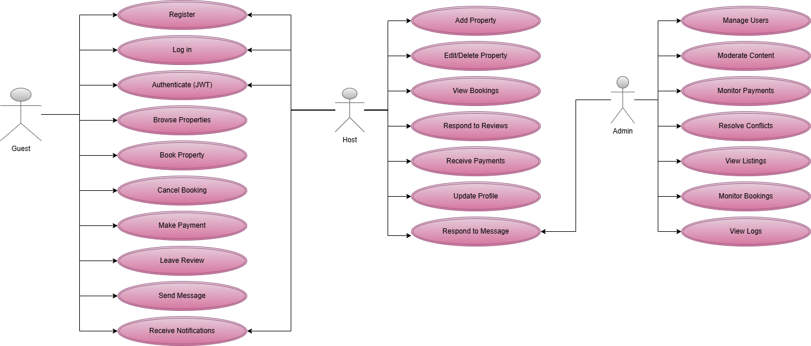

# Use Case Diagram - Airbnb Clone Backend

This diagram illustrates the interactions between users (guests, hosts, and admins) and the Airbnb Clone backend system. It provides a high-level overview of the major use cases each actor can perform.

---

## Actors

- **Guest**: A user looking to book properties.
- **Host**: A user listing and managing properties.
- **Admin**: A privileged user monitoring and managing the system.

---

## Use Cases

### Guest
- Register / Log in
- Authenticate (JWT)
- Browse Properties
- Book Property
- Cancel Booking
- Make Payment
- Leave Review
- Send Message
- Receive Notifications

### Host
- Add Property
- Edit/Delete Property
- View Bookings
- Respond to Reviews
- Receive Payments
- Update Profile
- Respond to Message

### Admin
- Manage Users
- Moderate Content
- Monitor Payments
- Resolve Conflicts
- View Listings
- Monitor Bookings
- View Logs

---

## Diagram

